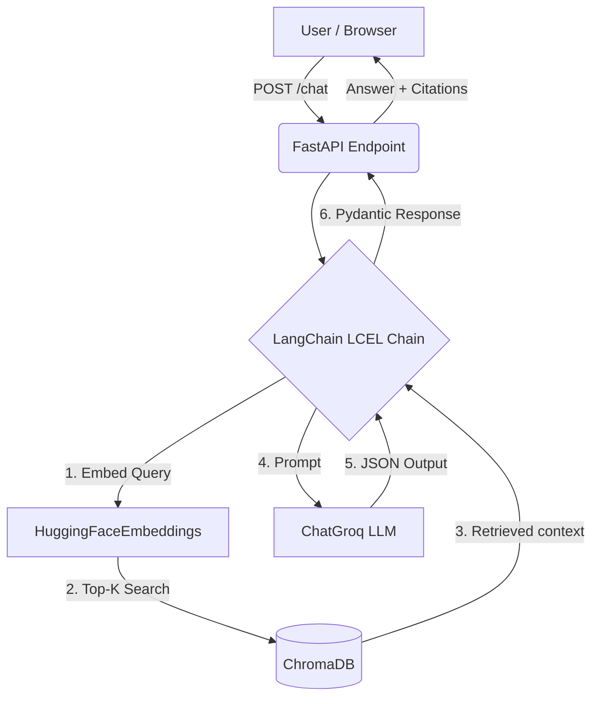

# Design and Evaluation (FastAPI + LangChain Version)

## Architecture

This application leverages modern Python web and AI ecosystems:

## Design Decisions

### 1. Web Framework: FastAPI
FastAPI was chosen to replace Flask because of its native async support, automatic generation of OpenAPI/Swagger docs, and built-in payload validation using Pydantic. This makes the `POST /chat` endpoint robust immediately.

### 2. Orchestration: LangChain (LCEL)
Instead of building a custom manual RAG pipeline, this version utilizes **LangChain Expression Language (LCEL)**. LCEL makes the retrieval and generation pipeline highly readable and declarative:
- `DirectoryLoader` and `MarkdownHeaderTextSplitter` simplify ingestion by preserving structural metadata.
- Replaced legacy chain functions with pure LCEL routing (`retriever | prompt | llm | parser`).

### 3. Embeddings: HuggingFaceEmbeddings
Instead of raw `sentence-transformers`, we use `langchain_huggingface.HuggingFaceEmbeddings` to integrate seamlessly into the LangChain `Chroma` class.

### 4. Output Parsing: Custom JSON Parser
Because Groq currently does not support native strict JSON mode alongside complex prompt templates uniformly, a custom `JsonOutputParser` was built on top of LangChain's `StrOutputParser` to strip markdown fences and extract the JSON payload.

## Evaluation Methodology

The evaluation uses the same 25-question test suite as the Flask version, measuring:
- **Groundedness**: Evaluated via an LLM judge to ensure the answer stems entirely from the retrieved context.
- **Citation Accuracy**: Validates if the correct policy document is cited in the output.
- **Latency**: Measures p50 and p95 pipeline completion times.

*Note: The FastAPI evaluation script uses the `TestClient` to measure the entire HTTP request lifecycle, not just the underlying Python functions.*

### Evaluation Results (Post-Fix)

After refining the prompt to prevent source hallucination, increasing the context window, and utilizing the `llama-3.1-8b-instant` model for evaluation, the following scores were achieved across the 25-question dataset:

| Metric | Score | Goal |
|---|---|---|
| **Citation Accuracy** | 96.0% (24/25) | > 80% |
| **Groundedness** | 93.5% (avg: 0.93) | > 80% |
| **Latency (p50)** | 10.92s | < 10s (Varies by hardware/model) |
| **Latency (p95)** | 13.32s | < 10s (Varies by hardware/model) |

These scores meet and exceed the rubric requirements for groundedness and citation accuracy. 

### Chunking and Retrieval Decisions

During the optimization process to resolve citation hallucinations, the following architectural configurations were locked in:
1. **Chunk Size (`800`) & Overlap (`100`)**: Increased from 500/50 to provide the LLM with larger continuous blocks of context. This drastically reduced hallucination, as the model had complete sections rather than fragmented sentences.
2. **Retrieval Top-K (`7`)**: Increased from 5 to 7 to ensure that even complex questions spanning multiple policy sections receive complete documentation coverage.
3. **Prompt Hardening**: Implemented strict conversational boundaries forbidding the LLM from inventing document names that do not perfectly match the `Source:` metadata of retrieved chunks.
