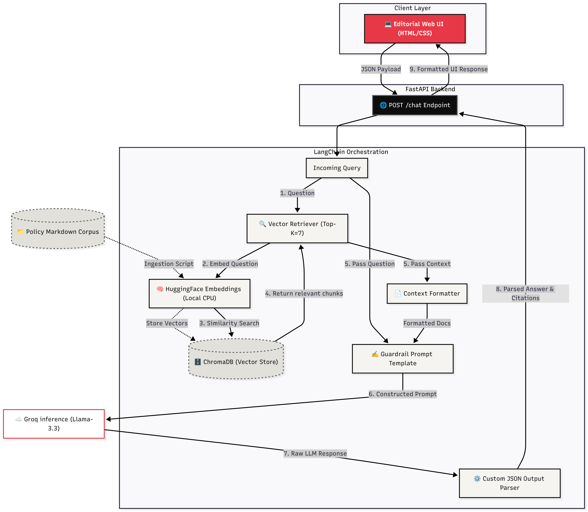

# System Architecture: Meridian Policy Intelligence

The following diagram illustrates the complete Retrieval-Augmented Generation (RAG) architecture for the Meridian Policy application, from the user interface down to the AI generation layer.

## Architecture Breakdown

### 1. Client Layer
The custom Editorial single-page application (`index.html`) sends asynchronous HTTP POST requests to the backend containing the user's policy query.

### 2. Application Layer
The FastAPI server (`main.py`) handles routing, request validation via Pydantic, and coordinates the response lifecycle. It acts as the gateway to the LangChain orchestration.

### 3. Orchestration Layer (LCEL)
The core of the logic lives in `app/rag/chain.py` using **LangChain Expression Language (LCEL)**. The pipeline runs automatically:
1. **Retrieval**: The user's question is passed to a local `HuggingFaceEmbeddings` model to calculate its vector coordinates, which are then used to perform a semantic similarity search against the local `ChromaDB` store.
2. **Context Formatting**: The Top-7 retrieved chunks (with their structural metadata preserved) are formatted into a string.
3. **Generation**: A strict prompt template combines the user's question, the retrieved context, and adherence guardrails, sending the payload to the external Llama 3.3 model hosted on Groq.
4. **Parsing**: The custom JSON parser ensures the raw Llama output is correctly decoupled into an explicit Answer and structured Citation Array before returning to the UI.
